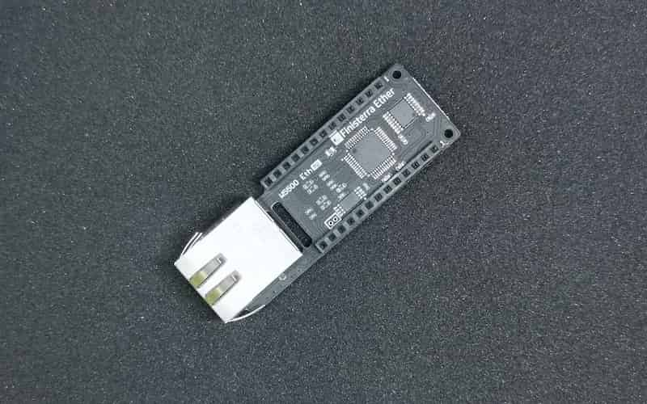

:repository-owner: crane-elec
:repository-name: EthernetSP

= {repository-name} Library for Spresense with W5500-Ether add-on board =

This library is a modified version of the standard Arduino Ethernet library, specifically adapted for the "W5500-Ether" add-on board for Spresense.

https://crane-elec.co.jp/products/vol-20/

== Usage
Most features are based on the original library. There are three differences from the original Ethernet library.

1:
change from
----
#include <Ethernet.h>
----
to
----
#include <EthernetSP.h>
----

2:
At the setup(), insert the following command according to the reset jumper setting:

When SJ1 is shorted at 1-2, use:
----
W5500ETH_reset(SJ1_12);
----
When SJ1 is shorted at 2-3, use:
----
W5500ETH_reset(SJ1_23);
----

3:
Insert the following command according to the SPI-SS jumper setting:

When SJ2 is shorted at 1-2, use:
----
Ethernet.init(SJ2_12);
----
When SJ2 is shorted at 2-3, use:
----
//Ethernet.init(); // Do nothing.
----

Other than that, it is the same as the original library.

== Original library

This library is based on the original Ethernet library provided by Arduino. You can find the original library at the following location:

link:https://github.com/arduino-libraries/Ethernet[Arduino Ethernet Library]

Please refer to the original library for more details about its usage and functionalities.

== License ==

Copyright (c) 2010 Arduino LLC. All right reserved.

This library is free software; you can redistribute it and/or
modify it under the terms of the GNU Lesser General Public
License as published by the Free Software Foundation; either
version 2.1 of the License, or (at your option) any later version.

This library is distributed in the hope that it will be useful,
but WITHOUT ANY WARRANTY; without even the implied warranty of
MERCHANTABILITY or FITNESS FOR A PARTICULAR PURPOSE. See the GNU
Lesser General Public License for more details.

You should have received a copy of the GNU Lesser General Public
License along with this library; if not, write to the Free Software
Foundation, Inc., 51 Franklin St, Fifth Floor, Boston, MA 02110-1301 USA
